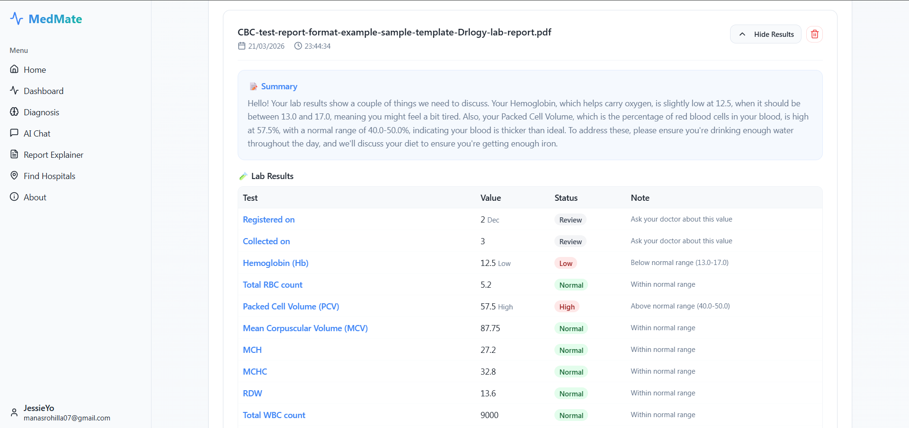
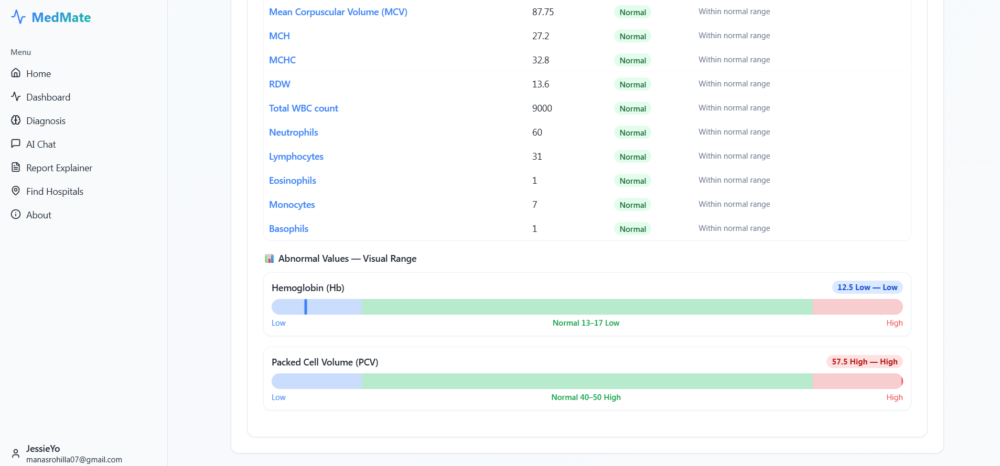
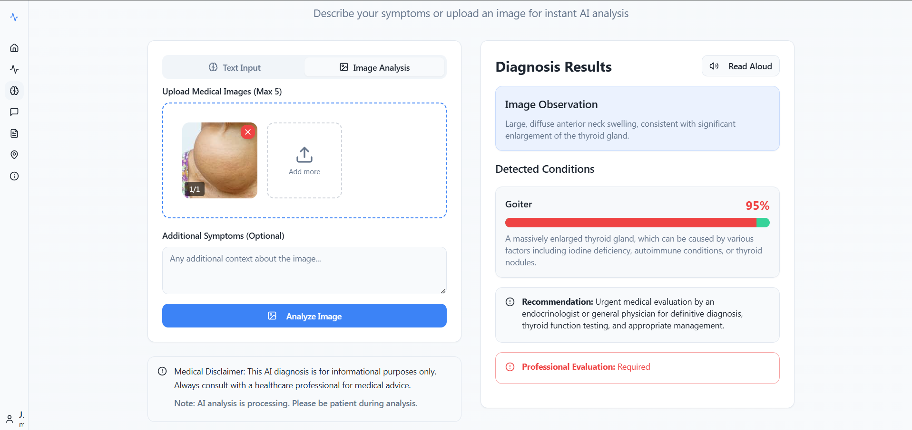

# 🏥 MedMate - AI Medical Assistant


## About MedMate

MedMate is an advanced AI-powered medical assistant platform that provides instant medical insights using cutting-edge AI technology. Built with **Google Gemini 2.5 Flash** for lightning-fast, accurate medical analysis.

## � Screenshots







### Why MedMate?

- 🚀 **Instant Analysis** - Get medical insights in seconds
- 🎯 **High Accuracy** - Powered by Google's latest Gemini 2.5 Flash model
- 🔒 **Secure & Private** - Your health data is encrypted and protected
- 📱 **Accessible Anywhere** - Works on desktop, tablet, and mobile
- 🌐 **24/7 Availability** - AI assistant available round the clock


### Core Functionality

#### 🤖 AI Symptom Diagnosis
- Describe your symptoms in natural language
- Get instant AI-powered analysis with confidence scores
- Receive detailed explanations and recommended solutions
- Urgency level assessment (Low/Medium/High)
- Voice input support for hands-free operation

#### 🖼️ Medical Image Analysis
- **Multiple Image Upload** - Upload up to 5 medical images at once
- AI-powered image analysis using Gemini Vision
- Detailed observations and condition detection
- Confidence scores for each detected condition
- Professional evaluation recommendations

#### 📄 Lab Report Analyzer
- **Multi-Format Upload** - Upload PDF, Image (PNG/JPG), or TXT medical lab reports
- **Visual Range Charts** - Beautiful CSS charts illustrating your test results against normal ranges
- **Jargon-Free Explanations** - AI translates complex medical terms into 3-4 simple sentences
- Structured data extraction for all major biomarkers

#### � Prescription Decoder
- **Handwriting Recognition** - Advanced OCR technology to read handwritten prescriptions and medical notes
- **Medical Term Extraction** - Automatically identifies and extracts medications, dosages, and instructions
- **AI-Powered Analysis** - Natural Language Processing to understand complex medical notations
- **Detailed Explanations** - Clear breakdown of medications and their purposes
- **Confidence Scoring** - Transparency into the accuracy of decoded prescriptions
- **Easy Upload** - Snap a photo of your prescription for instant analysis

#### �💬 24/7 AI Chat Assistant
- Interactive conversation with medical AI
- Context-aware responses
- Chat history tracking
- **Smart Audio Controls**:
  - Text-to-speech for all AI responses
  - Visual indicators for playing audio
  - Toggle play/pause on each message

#### 🏥 Hospital Finder
- Find nearby hospitals and medical facilities
- Integrated with Google Maps
- Real-time location services
- Hospital ratings and contact information
- Distance calculation from your location

#### 📊 Medical History Management
- Track all your diagnoses and AI insights
- View past symptom check conversations
- **Delete History** - Selectively remove individual history items or clear all data for your privacy

### Additional Features

- 🌍 **Multi-Language Support** - Full localization for 6 regional languages (English, Hindi, Bengali, Punjabi, Malayalam, Kannada)
- ✅ **User Authentication** - Secure login and registration
- ✅ **Voice Recognition** - Hands-free symptom input
- ✅ **Responsive UI** - Glassmorphism design system working flawlessly across all devices


## �🛠️ Tech Stack

### Frontend

- **React 18** - Modern UI framework
- **TypeScript** - Type-safe development
- **Vite** - Lightning-fast build tool
- **Tailwind CSS** - Utility-first styling
  
### Backend

- **Flask 3.x** - Python web framework
- **PostgreSQL** - Production database (Neon)

## 📁 Project Structure

```bash
 MedMate
 ├── api/                        # Backend API (Flask)
 │   ├── index.py                # Main Flask application
 │   └── requirements.txt        # Python dependencies for backend
 ├── public/                     # Static assets (favicons, robots.txt)
 ├── src/                        # Frontend Application Source
 │   ├── assets/                 # Images, icons, and global styles
 │   ├── components/             # Reusable UI components
 │   │   ├── ui/                 # Shadcn UI primitives
 │   │   ├── AppSidebar.tsx      # Sidebar navigation component
 │   │   ├── Navbar.tsx          # Top navigation bar component
 │   │   ├── Footer.tsx          # Application footer
 │   │   └── ProtectedRoute.tsx  # Authentication guard component
 │   ├── contexts/               # React Context providers (Auth, Theme, Language)
 │   ├── hooks/                  # Custom React hooks
 │   ├── lib/                    # Utilities and API client
 │   ├── locales/                # i18n translation files
 │   ├── pages/                  # Page components (Home, Dashboard, etc.)
 │   ├── translations/           # Translation configuration
 │   ├── App.tsx                 # Main application component with routes
 │   ├── main.tsx                # Application entry point
 │   └── index.css               # Global styles and Tailwind directives
 ├── static/                     # Backend static files (served by Flask)
 ├── components.json             # Shadcn UI configuration
 ├── postcss.config.js           # PostCSS configuration
 ├── tailwind.config.ts          # Tailwind CSS configuration
 ├── tsconfig.json               # TypeScript configuration
 ├── vite.config.ts              # Vite bundler configuration
 ├── vercel.json                 # Vercel deployment configuration
 ├── package.json                # Node.js dependencies and scripts
 └── README.md                   # Project documentation
```

## 🚀 Getting Started
- **Google Gemini 2.5 Flash** - AI model for analysis
- **Google Maps API** - Location services
- **Flask-CORS** - Cross-origin support


Made With ❤️ By Manas Rohilla
